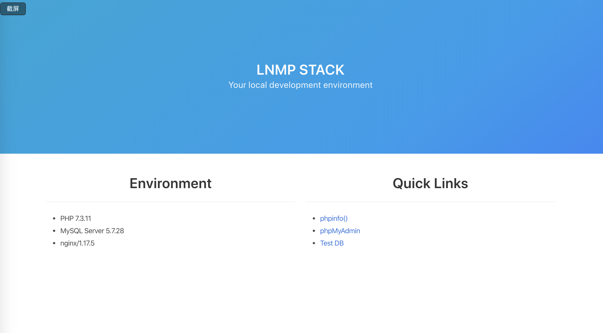

# 使用 Docker 部署 LNMP + Redis 环境



## 目录结构

```
lnmp
├── LICENSE
├── README.md
├── docker-compose.yml
├── lnmp.png
├── mysql
│   ├── data
│   ├── logs
│   ├── my.cnf
│   └── session
├── nginx
│   ├── certs
│   │   ├── default.key
│   │   └── default.pem
│   ├── conf.d
│   │   └── default.conf
│   └── logs
│       ├── access.log
│       └── error.log
├── php
│   ├── Dockerfile
│   └── config
│       ├── php-fpm.conf
│       ├── php-fpm.d
│       │   ├── docker.conf
│       │   ├── www.conf
│       │   ├── www.conf.default
│       │   └── zz-docker.conf
│       └── php.ini
├── redis
│   ├── data
│   ├── redis.conf
│   └── redis.log
└── www
    ├── assets
    │   └── css
    │       ├── bulma.css.map
    │       └── bulma.min.css
    ├── db.php
    ├── index.php
    ├── phpinfo.php
    └── redis.php
```

## 部署

> 直接使用docker-compose一键制作镜像并启动容器

```
git clone https://github.com/jangrui/docker-compose
cd docker-compose/lnmp
docker-compose up -d
```
