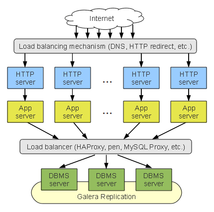

# Docker MySQL Galera Cluster



This configuration is about MySQL Galera Cluster. The following implementation
creates a cluster with 3 node.

## How To Start

- Download the project 

```
git clone http://github.com/jangrui/docker-compose

cd docker-compose/mysql-galera-cluster
```

- There are two deployment scenarios:

    - volume

    ```    
    docker-compose up -d
    ```

    - bind

    ```
    sudo chown -R 1001:1001 $(grep ^data= .env|cut -d = -f 2
    
    docker-compose -f docker-compose-bind.yml up -d`
    ```

- Connection haproxy

Wait a few minutes, mysql galera cluster after initialization is complete, for haproxy to create a mysql user.

```
docker exec -it galera-db1 mysql -uroot -proot -e "CREATE USER 'haproxy'@'%';"
```
