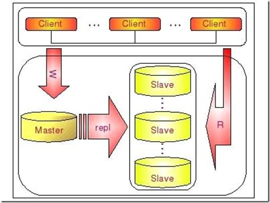

# Docker MySQL Replicas Cluster



This configuration is about MySQL Replicas Cluster. The following implementation
creates a cluster with 1 master and 2 slave nodes.

## How To Start

```
git clone http://github.com/jangrui/docker-compose

cd docker-compose/mysql-replicas-cluster
```
