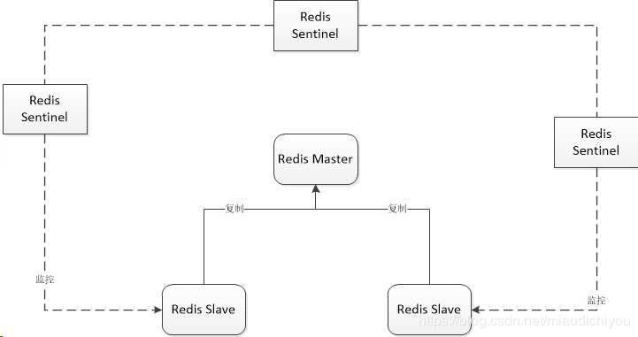

# Docker Redis Cluster

This configuration is about Redis Cluster. The following implementation
creates a cluster with 1 master and 2 replicas and 3 sentinel.

### How To Start

1. Download the project `$ git clone http://github.com/jangrui/docker-compose`
2. `cd docker-compose/redis-cluster`
3. `docker-compose up -d`
