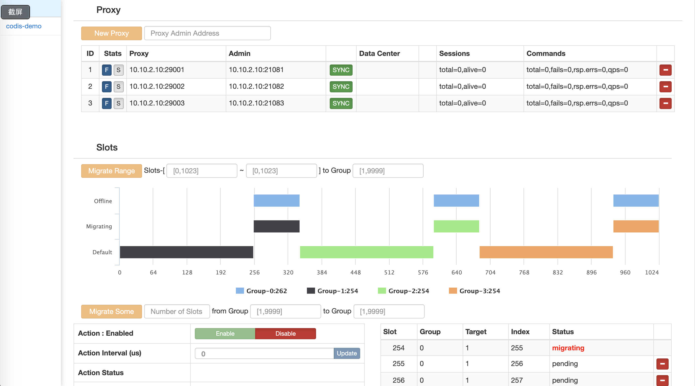

# Docker 部署 Redis Codis 集群



## 目录结构

```
redis-codis-cluster
├── Dockerfile
├── README.md
├── codis.png
├── config
│   ├── dashboard.toml
│   ├── proxy.toml
│   └── redis.conf
└── docker-compose.yml
```

## 部署

> 直接使用docker-compose一键启动

```
git clone https://github.com/jangrui/docker-compose
cd docker-compose/redis-codis-cluster

netname=`ip route | grep default | awk '{print $5}'`
hostip=`ifconfig $netname | grep "inet " | awk -F " " '{print $2}'`
echo $hostip

sed -i "s,10.10.2.10,$hostip,g" .env
sed -i "s,10.10.2.10,$hostip,g" ./config/dashboard.toml

docker-compose up -d

sleep 10s

# 添加 proxy
docker exec -it codis-fe codis-admin --dashboard=$hostip:28080 --create-proxy -x $hostip:21081
docker exec -it codis-fe codis-admin --dashboard=$hostip:28080 --create-proxy -x $hostip:21082
docker exec -it codis-fe codis-admin --dashboard=$hostip:28080 --create-proxy -x $hostip:21083

# 添加 group
docker exec -it codis-fe codis-admin --dashboard=$hostip:28080  --create-group   --gid=1
docker exec -it codis-fe codis-admin --dashboard=$hostip:28080  --create-group   --gid=2
docker exec -it codis-fe codis-admin --dashboard=$hostip:28080  --create-group   --gid=3
docker exec -it codis-fe codis-admin --dashboard=$hostip:28080 --group-add --gid=1 --addr=$hostip:26381
docker exec -it codis-fe codis-admin --dashboard=$hostip:28080 --group-add --gid=1 --addr=$hostip:26382
docker exec -it codis-fe codis-admin --dashboard=$hostip:28080 --group-add --gid=2 --addr=$hostip:26383
docker exec -it codis-fe codis-admin --dashboard=$hostip:28080 --group-add --gid=2 --addr=$hostip:26384
docker exec -it codis-fe codis-admin --dashboard=$hostip:28080 --group-add --gid=3 --addr=$hostip:26385
docker exec -it codis-fe codis-admin --dashboard=$hostip:28080 --group-add --gid=3 --addr=$hostip:26386

# 测试
docker exec -it codis-fe redis-cli -h $hostip -p 29000 info
```
