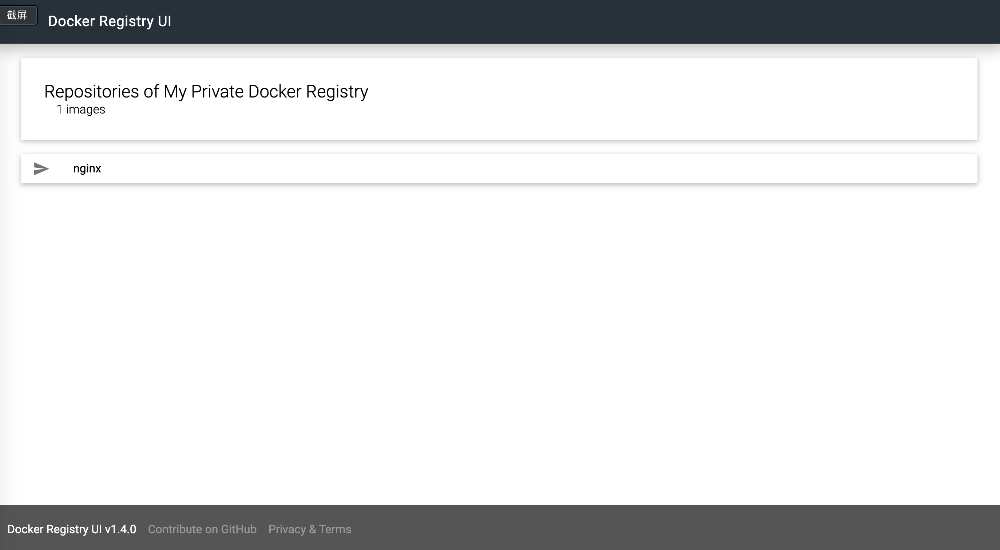

# Docker 部署 Registry + WebUI 环境



## 目录结构

```
registry-mirror
├── README.md
├── conf
│   ├── example.com.conf
│   ├── example.com.crt
│   ├── example.com.key
│   ├── hub.yml
│   ├── nginx.env
│   └── passwd
├── docker-compose.yml
└── hub.png
```

## 部署

> 直接使用docker-compose一键制作镜像并启动容器

```
git clone https://github.com/jangrui/docker-compose
cd docker-compose/registry-mirror
docker-compose up -d
```
